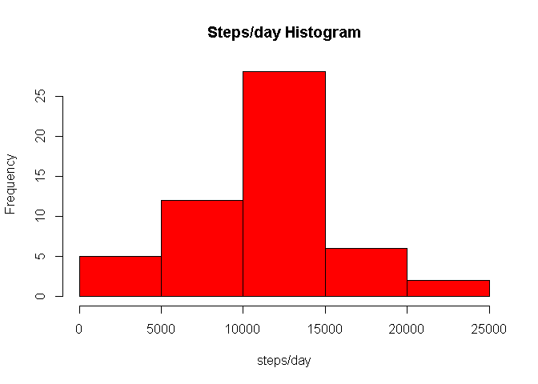
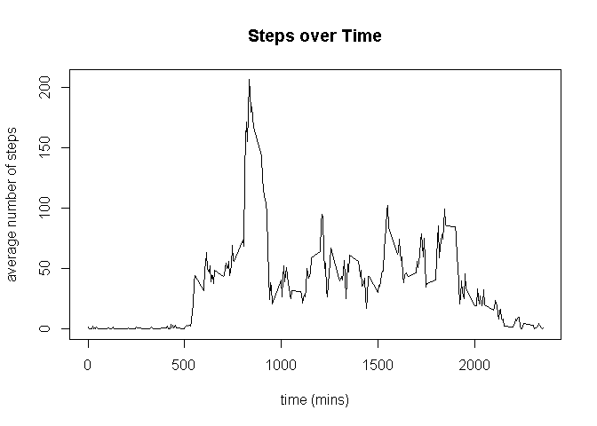
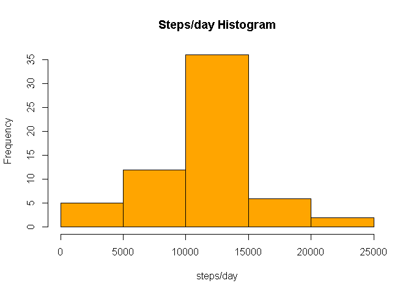
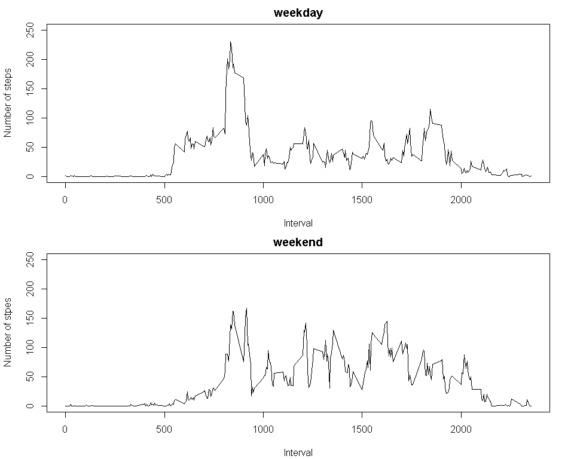

## Loading and preprocessing the data
the file is read in and "NA" values are removed


```r
file_name <- "activity.csv"
dat_na <- read.csv("activity.csv")
dat <- dat_na[!is.na(dat_na$steps),]
```

## What is mean total number of steps taken per day?


```r
total_steps_per_day <- sum(dat$steps)/nlevels(dat$date)
gb_date <- group_by(dat,date)
dat_steps_per_day <- summarize(gb_date, steps_per_day = sum(steps))
median <- summary(dat_steps_per_day$steps_per_day)["Median"]
mean <- summary(dat_steps_per_day$steps_per_day)["Mean"]
hist(dat_steps_per_day$steps_per_day,
     col = "red", 
     breaks = 5, 
     xlab = "steps/day", 
     main = "Steps/day Histogram")
```

<!-- -->

- The total number of steps/day is 9354.2295082.  
- The median of the steps/day is 1.0765\times 10^{4}.  
- The mean of the steps/day is 1.0766189\times 10^{4}.  

## What is the average daily activity pattern?


```r
gb_interval <- group_by(dat, interval)
dat_time_series <- summarize(gb_interval, avg_num_steps = mean(steps))
max_interval <- dat_time_series[which.max(dat_time_series$avg_num_steps),]$interval
plot(dat_time_series$interval, dat_time_series$avg_num_steps, 
     type = "l", 
     xlab = "time (mins)", 
     ylab = "average number of steps", 
     main = "Steps over Time")
```

<!-- -->

- The maximum number of steps taken over all of the days occured during time interval 835 .  

## Imputing missing values

```r
na_count <- sum(is.na(dat_na))
dat_na_rep <- dat_na
for (i in 1:nrow(dat_na_rep)){
        if (is.na(dat_na_rep[i,"steps"])){
                int <- dat_na_rep[i,"interval"]
                int_avg_steps <- dat_time_series[dat_time_series$interval == int,]$avg_num_steps
                dat_na_rep[i,"steps"] <- int_avg_steps
        }
}

gb_date_rep <- group_by(dat_na_rep,date)
dat_steps_per_day_rep <- summarize(gb_date_rep, steps_per_day = sum(steps))
median_rep <- summary(dat_steps_per_day_rep$steps_per_day)["Median"]
mean_rep <- summary(dat_steps_per_day_rep$steps_per_day)["Mean"]

hist(dat_steps_per_day_rep$steps_per_day,
     col = "orange", 
     breaks = 5, 
     xlab = "steps/day", 
     main = "Steps/day Histogram")
```

<!-- -->

Here we replace NA values in the _Steps_ column with the average number of steps during the specified time interval across all possible dates.  

- The median of the steps/day is 1.0766189\times 10^{4}.  
- The mean of the steps/day is 1.0766189\times 10^{4}.  
- To look at the change we can take the difference between the previously calculated median and mean.  

The mean difference is 0 and the median difference is 1.1886792. Allowing us to conclude that the difference between omitting NAs and replacing NA's is negligible.  

## Are there differences in activity patterns between weekdays and weekends?
To answer this question we group the data by weekend or weekday and then plot the average number of steps over each interval.  

```r
weekend <- function(day){
        day <- weekdays(as.POSIXct(day))
        if (day == "Sunday" | day == "Saturday"){
                return(as.factor("weekend"))
        }
        else {
                return(as.factor("weekday"))
        }
}

if(!exists("mt_week")){
        mt_week <- mutate(dat_na_rep, week_class = sapply(date,weekend))
}

gb_interval_week <- group_by(mt_week,week_class, interval)
dat_time_series_week <- summarize(gb_interval_week, avg_num_steps = mean(steps))

weekday_tb <-dat_time_series_week[dat_time_series_week$week_class == "weekday",]
weekend_tb <-dat_time_series_week[dat_time_series_week$week_class == "weekend",]

par(mfrow = c(2,1), mar = c(4.1, 4.1, 2.1, 2.1))
plot(weekday_tb$interval, weekday_tb$avg_num_steps, 
     type = "l",
     xlab = "Interval", 
     ylab = "Number of steps",
     ylim = c(0,250),
     main = "weekday")

plot(weekend_tb$interval, weekend_tb$avg_num_steps, 
     type = "l", 
     xlab = "Interval", 
     ylab = "Number of stpes",
     ylim = c(0,250),
     main = 'weekend')
```

<!-- -->
